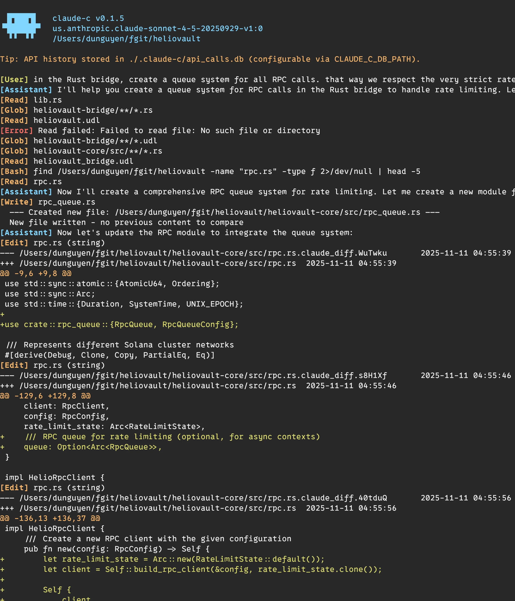
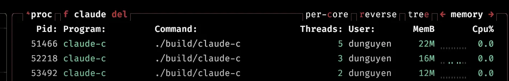

# Klawed

A fast, lightweight AI coding agent built entirely in C. Klawed provides a rich terminal UI, supports multiple LLM providers, and ships with a comprehensive tool suite for code editing, file operations, task delegation, and persistent memory.



## Features

- **Pure C implementation** — Fast startup, minimal memory footprint, no Node.js or Python runtime required
- **Vim-inspired TUI** — Modal interface with syntax highlighting, themes, fuzzy file search, and conversation history
- **Multi-provider support** — OpenAI, Anthropic, AWS Bedrock, OpenRouter, DeepSeek, Moonshot/Kimi, Z.AI, and any OpenAI-compatible API
- **13+ built-in tools** — Read, Write, Edit, MultiEdit, Bash, Glob, Grep, Subagent, MemoryStore/Recall/Search, TodoWrite, Sleep
- **Persistent memory** — SQLite-based long-term memory with FTS5 full-text search across sessions
- **Secret redaction** — API keys, tokens, and passwords are automatically redacted in logs, TUI output, and tool results
- **Auto-compaction** — Automatically archives old conversation context to keep within token limits
- **MCP support** — Connect to external Model Context Protocol servers for additional tools
- **Web research** — Explore mode with DuckDuckGo search and Playwright-based page reading

## Installation

### macOS

```bash
brew install curl cjson libbsd ncurses
```

### Ubuntu/Debian

```bash
sudo apt-get install libcurl4-openssl-dev libcjson-dev libbsd-dev libncurses-dev build-essential
```

### Build

```bash
git clone --branch v0.32.70 https://github.com/nmnduy/klawed.git
cd klawed
make
```

The binary is produced at `build/klawed`.

**Optional: install locally**
```bash
make install  # installs to $HOME/.local/bin/klawed
```

## Quick Start

```bash
export OPENAI_API_KEY="your-key"
./build/klawed
```

Run with a prompt in one-shot mode:

```bash
./build/klawed "refactor the auth module to use JWT"
```

## Provider Configuration

Klawed supports many providers out of the box. Configure them in `~/.klawed/config.json` or `.klawed/config.json`:

```json
{
  "active_provider": "sonnet-4.5-bedrock",
  "providers": {
    "gpt-4o": {
      "provider_type": "openai",
      "model": "gpt-4o"
    },
    "sonnet-4.5-bedrock": {
      "provider_type": "bedrock",
      "model": "us.anthropic.claude-3-5-sonnet-20241022-v2:0"
    },
    "claude-opus-4": {
      "provider_type": "anthropic",
      "model": "claude-opus-4"
    },
    "deepseek-chat": {
      "provider_type": "openai",
      "model": "deepseek-chat",
      "api_base": "https://api.deepseek.com",
      "api_key_env": "DEEPSEEK_API_KEY"
    },
    "kimi-for-coding": {
      "provider_type": "kimi_coding_plan",
      "model": "kimi-for-coding"
    }
  }
}
```

Switch providers at runtime or via environment variable:

```bash
KLAWED_LLM_PROVIDER=deepseek-chat ./build/klawed "hello"
```

**OAuth providers** (Kimi Coding Plan, OpenAI Subscription, Anthropic Subscription) require no API key — just browser authentication on first use.

You can also create shell aliases for quick provider switching:

```bash
alias deepseek-chat="OPENAI_API_KEY=*** OPENAI_API_BASE=https://api.deepseek.com OPENAI_MODEL=deepseek-chat klawed"
alias glm-4.7="OPENAI_API_KEY=*** OPENAI_API_BASE=https://api.z.ai/api/paas/v4/chat/completions OPENAI_MODEL=glm-4.7 klawed"
alias kimi-k2-thinking="OPENAI_API_KEY=$MOONS..._KEY OPENAI_API_BASE=https://api.moonshot.ai OPENAI_MODEL=kimi-k2-thinking klawed"
alias kimi-for-coding="KLAWED_LLM_PROVIDER=kimi-for-coding klawed"
alias gpt-5-1-codex-max="OPENAI_API_KEY=$OPENR..._KEY OPENAI_API_BASE=https://openrouter.ai/api/v1/chat/completions OPENAI_MODEL=openai/gpt-5.1-codex-max klawed"
alias minimax-2.1-coding-plan="ANTHROPIC_BASE_URL=https://api.minimax.io/anthropic/v1/messages OPENAI_API_KEY=$MINIM..._KEY OPENAI_MODEL=MiniMax-M2.1 ANTHROPIC_VERSION=2023-06-01 OPENAI_API_BASE= klawed"
```

See [docs/llm-provider-configuration.md](docs/llm-provider-configuration.md) for full details.

## Usage Modes

### Interactive Mode

Run without arguments to enter the TUI:

```bash
./build/klawed
```

The TUI supports vim-like navigation, command mode (`:`), file search (`Ctrl+F`), history search (`Ctrl+R`), and slash commands (`/clear`, `/dump`, etc.).

See [docs/keyboard-shortcuts.md](docs/keyboard-shortcuts.md) for the full keymap.

### One-Shot Mode

Pass a prompt as an argument for single-turn execution:

```bash
./build/klawed "generate a Makefile for this C project"
```

## Tools

Klawed exposes a rich tool suite to the LLM:

| Tool | Description |
|------|-------------|
| **Read** | Read files with optional line ranges |
| **Write** | Write or overwrite files |
| **Edit** / **MultiEdit** | String replacement editing (single or batch) |
| **Bash** | Execute shell commands with configurable timeout |
| **Glob** | Find files by pattern |
| **Grep** | Search file contents with regex support |
| **Subagent** | Spawn a fresh klawed instance for delegated tasks |
| **CheckSubagentProgress** | Monitor a running subagent |
| **InterruptSubagent** | Stop a stuck subagent |
| **MemoryStore** / **MemoryRecall** / **MemorySearch** | Persistent SQLite memory with FTS5 |
| **TodoWrite** | Update a tracked task list |
| **Sleep** | Pause execution |

**MCP tools** — Connect to external MCP servers for additional capabilities:

```bash
KLAWED_MCP_ENABLED=1 KLAWED_MCP_CONFIG=mcp.json ./build/klawed
```

**Explore mode** — Enable web search and browsing:

```bash
KLAWED_EXPLORE_MODE=1 ./build/klawed "research the latest Go concurrency patterns"
```

## Key Features

### Persistent Memory

Klawed remembers facts, preferences, and context across sessions using an SQLite database with FTS5 full-text search. The agent can store, recall, and search memories automatically.

- Database: `.klawed/memory.db`
- Customize path: `KLAWED_MEMORY_PATH=/path/to/memory.db`

See [docs/memory_db.md](docs/memory_db.md).

### Auto-Compaction

For long conversations, auto-compaction archives older messages to the memory database and replaces them with an AI-generated summary. This keeps the active context window manageable without losing history.

```bash
KLAWED_AUTO_COMPACT=1 ./build/klawed
```

See [docs/auto_compaction.md](docs/auto_compaction.md).

### Subagents

Delegate independent tasks to fresh klawed instances with clean context. Useful for large codebases, parallel exploration, or avoiding context limits.

```json
{
  "prompt": "Analyze all Python files and create a summary report",
  "timeout": 300,
  "provider": "gpt-4o-mini"
}
```

See [docs/subagent.md](docs/subagent.md).

### Themes

Built-in color themes: `tender`, `dracula`, `gruvbox-dark`, `solarized-dark`, `solarized-light`, `ayu`, `molokai`, and more. Load Kitty `.conf` theme files via `KLAWED_THEME`.

See [docs/COLOR_THEMES.md](docs/COLOR_THEMES.md).

## Configuration

Configuration files (merged, local overrides global):

- Global: `~/.klawed/config.json`
- Local: `.klawed/config.json`

Common environment variables:

| Variable | Description |
|----------|-------------|
| `OPENAI_API_KEY` | API key fallback |
| `OPENAI_MODEL` | Model fallback |
| `OPENAI_API_BASE` | API base URL fallback |
| `KLAWED_LLM_PROVIDER` | Select named provider |
| `KLAWED_MAX_TOKENS` | Max completion tokens (default: 16384) |
| `KLAWED_BASH_TIMEOUT` | Bash timeout in seconds (default: 30) |
| `KLAWED_THEME` | Path to Kitty theme `.conf` |
| `KLAWED_AUTO_COMPACT` | Enable auto-compaction |
| `KLAWED_MCP_ENABLED` | Enable MCP |
| `KLAWED_EXPLORE_MODE` | Enable explore mode |
| `KLAWED_LOG_LEVEL` | DEBUG / INFO / WARN / ERROR |

See [docs/provider-env-vars.md](docs/provider-env-vars.md) for the full list.

## Memory Footprint



Klawed is designed to stay lightweight. A typical session uses ~20-40 MB RSS, compared to hundreds of MB for agents built on heavier runtimes.

## Development

```bash
make check-deps   # Verify dependencies
make              # Build
make test         # Run unit tests
make fmt-whitespace  # Format code
```

**macOS note:** If you see "invalid option" errors from make, you may have the old system make (3.81). Install a newer version with `brew install make` and use `gmake`, or use `./make_wrapper.sh`.

**Testing with sanitizers:**
```bash
make clean && make SANITIZE=1 test
```

## Security Notes

- Bash tool has full shell access — intended for trusted environments only
- File tools can access any readable/writable file
- API keys are read from environment variables or config files (not hardcoded)
- Secret values are redacted in logs and TUI output

## Documentation

- [Architecture](docs/ARCHITECTURE.md)
- [LLM Provider Configuration](docs/llm-provider-configuration.md)
- [Keyboard Shortcuts](docs/keyboard-shortcuts.md)
- [Subagent](docs/subagent.md)
- [Memory System](docs/memory_db.md)
- [Auto-Compaction](docs/auto_compaction.md)
- [Color Themes](docs/COLOR_THEMES.md)
- [Streaming](docs/streaming.md)

## License

See [LICENSE](LICENSE) for details.
